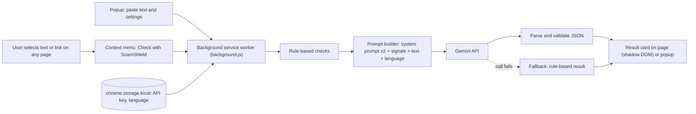

# ScamShield - Project Phases

**Event:** Innovation Week Day 4, AI for Good Challenge (Topic 3: AI for a safer and more inclusive digital society)
**Idea:** Chrome extension that checks a suspicious message or link and explains the result in simple English, Hindi or Telugu.
**Time box:** 45 minutes (shift the minute marks if you get more time)

## Phase plan

| Phase | Time | Goal | Output | Owner | Done when | Presentation point |
|---|---|---|---|---|---|---|
| 0. Lock the idea | 0-5 min | Agree on problem, users, roles | One-line problem + target users | Everyone | All 4 know their role | 1 Problem, 2 Target users |
| 1. Prompt work | 5-15 min | Test prompt v1, then improve it | v1 and v2 prompts with screenshots of both outputs | Person 1 | Both outputs saved | 3 Initial idea, 4 Prompt used, 5 Improved prompt, 6 AI output |
| 2. Build extension | 5-25 min | Working right-click check | Loaded extension showing a result card | Person 2 | 1 scam and 1 safe message tested | 7 Final solution, 8 Prototype |
| 3. Slides | 10-30 min | Slides for all 10 points | Deck with prompt screenshots | Person 3 | All 10 points have a slide | All |
| 4. Integrate and record | 30-40 min | Add demo proof to slides | Screenshots + 30 sec screen recording | Person 2 + 3 | Recording plays | 8 Prototype, 9 Impact |
| 5. Rehearse | 40-45 min | Run the full talk once | Speaking order | Leader | Timed run finished | 10 Limitations and future |

## Cut rules (protect the deadline)
- 25 min and the extension still fails: stop building. Demo prompt v2 live in a chatbot as the prototype.
- Never spend time on styling, accounts or databases.
- Keep every prompt version and output. Judges score the Prompt > Output > Improved > Impact journey.

## After the event (roadmap for slide 10)
| Version | Adds |
|---|---|
| v1.1 | Read-aloud for low-literacy users, more languages |
| v1.2 | Check links against known phishing lists |
| v2 | Community reporting of new scams, small backend, usage analytics |
| v3 | Same checker for WhatsApp Web and email |

## Rule compliance checklist
- [ ] 4 members, 1 leader, all speak or demo
- [ ] Tools used and purpose written on a slide (Gemini API: scam analysis; AI chatbot: prompt testing; Antigravity: coding help)
- [ ] AI outputs checked by the team, corrections visible
- [ ] No real personal data used in tests
- [ ] Own decisions shown (rule-based checks, JSON output, language option, fallback)
- [ ] Limitations slide is honest

---

# Architecture

## Components
| Component | File | Job |
|---|---|---|
| Manifest | manifest.json | Permissions: contextMenus, storage, scripting, activeTab. Host: generativelanguage.googleapis.com |
| Context menu | background.js | Adds "Check with ScamShield" for selected text and links |
| Popup | popup.html, popup.js | Save API key and language, paste text and check |
| Background worker | background.js | Runs checks, builds prompt, calls the API, handles fallback |
| Rule engine | background.js (ruleSignals) | Flags urgency, OTP/PIN asks, fees, prizes, short links, odd domains, fake job pitches, KYC asks |
| Prompt v2 | background.js (SYSTEM_PROMPT) | Role, Indian scam context, rules, simple reading level, strict JSON |
| Result card | background.js (renderCard) | Verdict, reasons, advice, injected in a shadow DOM so page CSS cannot break it |
| Storage | chrome.storage.local | API key and language, stays on the user's device |

## Data flow
1. User selects text and right-clicks (or pastes into the popup).
2. Background worker shows a "Checking" card.
3. Rule engine finds warning signals.
4. Prompt builder combines system prompt, signals, the text (max 4000 characters) and the reply language.
5. Gemini API returns JSON: verdict, confidence, summary, reasons, advice.
6. Worker validates the JSON. If the call or parsing fails, it uses the rule-based fallback.
7. Result card shows the verdict in plain language.

## Privacy
- Only the selected or pasted text is sent to the AI. Nothing is stored except the API key and language.
- No accounts, no backend, no tracking.
