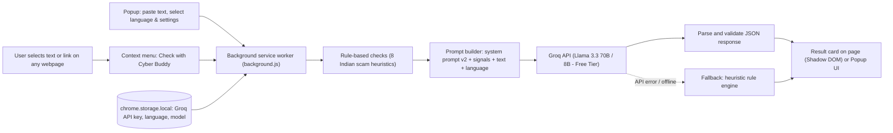

# Cyber Buddy - Project Phases

**Event:** Innovation Week Day 4, AI for Good Challenge (Topic 3: AI for a safer and more inclusive digital society)
**Idea:** Chrome extension that checks a suspicious message or link and explains the result in simple English, Hindi or Telugu using Groq Free Tier LLMs.
**Time box:** 45 minutes (shift the minute marks if you get more time)

## Phase plan

| Phase | Time | Goal | Output | Owner | Done when | Presentation point |
|---|---|---|---|---|---|---|
| 0. Lock the idea | 0-5 min | Agree on problem, users, roles | One-line problem + target users | Everyone | All 4 know their role | 1 Problem, 2 Target users |
| 1. Prompt work | 5-15 min | Test prompt v1, then improve it | v1 and v2 prompts with test outputs (Groq Llama 3.3 70B) | Person 1 | Both outputs saved | 3 Initial idea, 4 Prompt used, 5 Improved prompt, 6 AI output |
| 2. Build extension | 5-25 min | Working right-click check & popup | Loaded extension showing Cyber Buddy card | Person 2 | 1 scam and 1 safe message tested | 7 Final solution, 8 Prototype |
| 3. Slides | 10-30 min | Slides for all 10 points | Deck with prompt screenshots & architecture | Person 3 | All 10 points have a slide | All |
| 4. Integrate and record | 30-40 min | Add demo proof to slides | Screenshots + 30 sec screen recording | Person 2 + 3 | Recording plays | 8 Prototype, 9 Impact |
| 5. Rehearse | 40-45 min | Run the full talk once | Speaking order | Leader | Timed run finished | 10 Limitations and future |

## Cut rules (protect the deadline)
- 25 min and the extension still fails: stop building. Demo prompt v2 live in Groq Playground / Chat as the prototype.
- Never spend time on complex styling, user accounts, or backend databases.
- Keep every prompt version and output. Judges score the Prompt > Output > Improved > Impact journey.

## After the event (roadmap for slide 10)
| Version | Adds |
|---|---|
| v1.1 | Voice read-aloud for low-literacy users, more regional Indian languages (Tamil, Bengali, Marathi) |
| v1.2 | Real-time link scanning against Indian Cybercrime Coordination Centre (I4C) & Chakshu database |
| v2.0 | Community reporting of new scam tactics, crowdsourced threat intelligence |
| v3.0 | Direct plugin for WhatsApp Web, Telegram Web, and Gmail client |

## Rule compliance checklist
- [x] 4 members, 1 leader, all speak or demo
- [x] Tools used and purpose written on a slide (Groq Cloud API: Llama 3.3 70B scam analysis; Antigravity: pairing & coding assistance)
- [x] AI outputs verified by team, safety guardrails enforced
- [x] No real personal data used in tests (synthetic Indian scam scenarios)
- [x] Own decisions shown (local rule-based heuristics, strict JSON schema, Hindi/Telugu support, offline fallback)
- [x] Limitations slide is transparent and realistic

---

# Architecture

## Components
| Component | File | Job |
|---|---|---|
| Manifest | `manifest.json` | Manifest V3 permissions: `contextMenus`, `storage`, `scripting`, `activeTab`. Host: `https://api.groq.com/*` |
| Context menu | `background.js` | Adds "Check with Cyber Buddy" context menu for selections and links |
| Popup | `popup.html`, `popup.js` | Configures Groq API key, model, and language; quick demo chips; pastes text and runs checks |
| Background worker | `background.js` | Coordinates rule signals, prompt assembly, Groq API call, JSON validation, and fallback |
| Rule engine | `background.js` (`ruleSignals`) | Flags urgency, OTP asks, UPI/QR requests, prizes, short links, shady TLDs, job traps, KYC threats, digital arrest |
| Prompt v2 | `background.js` (`SYSTEM_PROMPT`) | Role, Indian cybercrime context, safety guardrails, 10-year-old reading level, strict JSON schema |
| Result card | `background.js` (`renderCyberBuddyCard`) | Shadow DOM injection so host page CSS cannot alter appearance; accessible color badges and advice |
| Storage | `chrome.storage.local` | Secure local client storage for API key, model selection, and language preference |

## Data flow
1. User highlights text / link and right-clicks (or pastes into the Cyber Buddy popup).
2. Background worker displays a loading status card.
3. Local heuristic engine flags any high-risk patterns.
4. Prompt builder packages the system prompt, detected signals, user text, and chosen language.
5. Groq Cloud API evaluates the prompt via `llama-3.3-70b-versatile` in JSON mode.
6. Worker validates JSON structure. If offline or error occurs, the heuristic fallback kicks in automatically.
7. Accessible Cyber Buddy card presents the verdict, explanation, and safe action steps.

## Privacy & Safety
- Only the selected or pasted text is transmitted to Groq. No credentials or browsing histories are collected.
- Zero tracking, no external databases, zero user surveillance.
